# diagen.sh

**diagen.sh** (derived from *diagram generator*) is a simple tool for creating UML-like diagrams of classes (types), and flowcharts. In fact, this is a set of [m4](https://en.wikipedia.org/wiki/M4_(computer_language)) macros expanding into DOT language statements.

diagen.sh needs [Graphviz](https://graphviz.org/) to be installed on your system.

Usage:

    ./diagen.sh infile.gv.m4 outfile.svg

## Examples

### Structure Diagrams

#### Class With Attributes and Operations

    DIAGRAM
        CLASS(Foo)
            ATTRIBUTE(bar)
            STATIC ATTRIBUTE(baz)
            OPERATION(qux())
            STATIC OPERATION(quux())
        END
    END

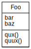

#### Note

    DIAGRAM
        NOTE(Blah blah blah, FooBar)
    END

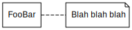

#### Interface

    DIAGRAM
        INTERFACE(Foo)
            ATTRIBUTE(bar)
            OPERATION(baz())
        END
    END

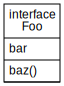

#### Abstract Class

    DIAGRAM
        ABSTRACT CLASS(Foo)
            ATTRIBUTE(bar)
            ABSTRACT ATTRIBUTE(baz)
        END
    END

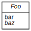

#### Enumeration

    DIAGRAM
        ENUMERATION(Foo)
            LITERAL(bar)
            LITERAL(baz)
            LITERAL(qux)
        END
    END

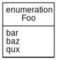

#### Package Containing Classes

    DIAGRAM
        PACKAGE(foobar)
            Foo
            Bar
        END
    END

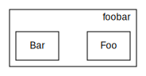

#### Module Containing Operations and Classes

    DIAGRAM
        MODULE(foo)
            OPERATION(bar())
            OPERATION(baz())
        END

        NESTINGS
            {Qux Quux} -> foo
        END
    END

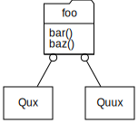

#### Other Entities

    DIAGRAM
        COMPONENT(foo)
        COLLABORATION(bar)
        USECASE(baz)
        NODE(qux)
        ARTIFACT(quux)
    END

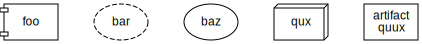

#### Relations

    DIAGRAM
        ASSOCIATIONS
            Foo1 -> Bar1
        END

        BIDIRECTIONAL ASSOCIATIONS
            Foo2 -> Bar2
        END

        GENERALIZATIONS
            Foo3 -> Bar3
        END

        DEPENDENCIES
            Foo4 -> Bar4
        END

        AGGREGATIONS
            Foo5 -> Bar5
        END

        COMPOSITIONS
            Foo6 -> Bar6
        END

        IMPLEMENTATIONS
            Foo7 -> Bar7
        END
    END

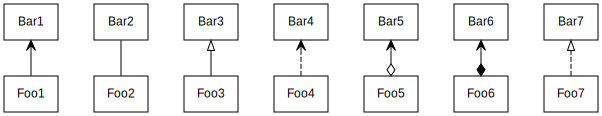

### Behavior Diagrams (Flowcharts)

#### Condition Check

    BEHAVIOR DIAGRAM
        INITIAL_NODE(in)
        FINAL_NODE(fn)
        DECISION(foo)
        MERGE(m)

        in -> foo
        TRANSITION(foo -> bar, true)
        TRANSITION(foo -> baz, false)
        {bar baz} -> m -> fn
    END

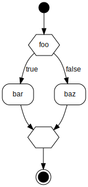

#### Concurrent Activities

    BEHAVIOR DIAGRAM
        INITIAL_NODE(in)
        FINAL_NODE(fn)
        FORK(f)
        JOIN(j)
        in -> f -> {foo bar} -> j -> fn
    END

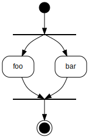

#### Subactivity

    BEHAVIOR DIAGRAM
        INITIAL_NODE(in)
        FINAL_NODE(fn)

        SUPERACTION(barbaz)
            bar -> baz
        END

        in -> foo -> bar
        baz -> qux -> fn
    END

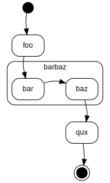
